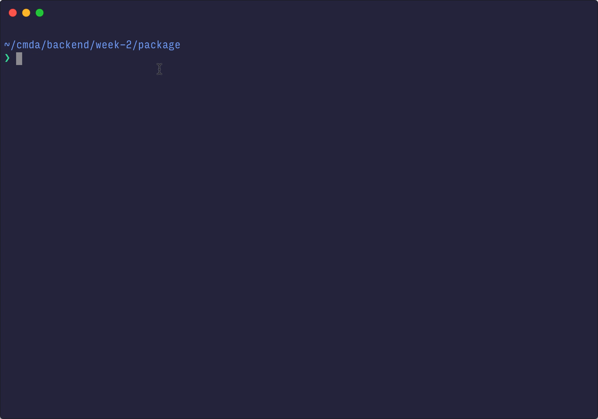

# deprofanitise

> 🛀 Clean your text of profanities from the CLI.


This project was created as part of [CMDA/backend](https://github.com/cmda-be) course.

## Usage

```
$ git clone https://github.com/Murderlon/deprofanitise
```

```
$ node index.js
```

## License

[MIT](https://oss.ninja/mit/murderlon) © [Murderlon](https://github.com/Murderlon).
